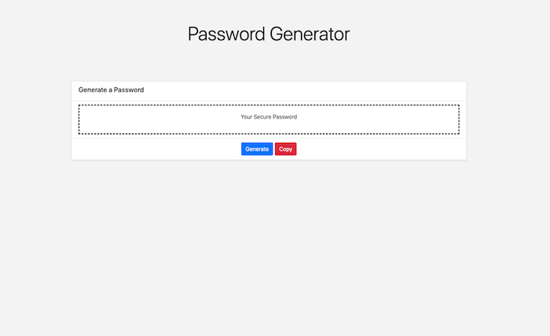
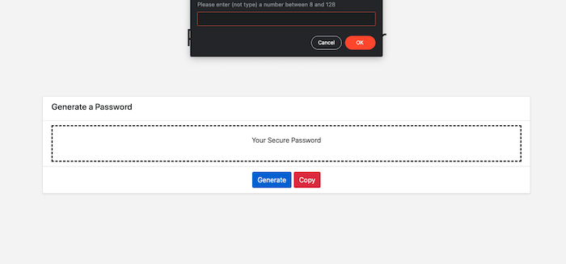
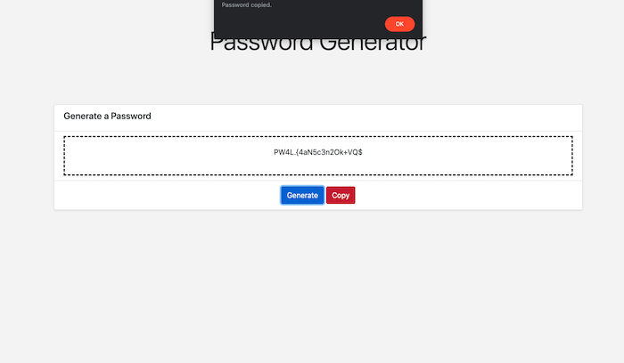

# Password Generator

## Description

I was assigned to create a password generator in JavaScript, and a page to house it through HTML/CSS. 
The password generator was required to take user input regarding the number and type of characters used and validate that input to ensure a password could be generated. 
The HTML page was required to be responsive.

To that end, I began the project by building a simple page structure in HTML using Bootstrap's CSS. 
I then focused on what I assumed would be the greatest hurdle, building a password generator.
While I originally planned to generate the password primarily through for loops and math methods, research into array methods on W3Schools allowed me to construct a more elegant solution.
The password conditions are evaluated through user prompts and a series of if and if/else statements before the required arrays are merged into one set of characters, which a for loop can pick from at random.
Once I had a working generator, I linked it to a button on the HTML page through an addEventListener, a first for me.
I refined the appearance of the page using Bootstrap code and my own CSS, refining the password generator as continued testing revealed small problems.
Finally, I added a copy button and function, letting the user quickly save a generated password to their clipboard.

While this linear approach to the project resulted in code that I feel could likely be further condensed and refined, e.g. by rewriting lines into additional functions and/or using prototype array methods such as .flat, it let me construct a working prototype much faster than I expected to. 
Because of that, I'm very proud of the work I've done here.
While I may continue to update this code for the sake of practice, I appreciate it as is as a record of a project I particularly enjoyed.

## 'Installation'/Usage

The site can be accessed at [https://mavn2.github.io/classrep/3hw/](https://mavn2.github.io/classrep/3hw). 
The code is stored in the 3hw folder in the classrep repository on my GitHub page, at [https://github.com/mavn2/classrep/tree/master/3hw](https://github.com/mavn2/classrep/tree/master/3hw).

The password generator as it appears when opened. Clicking the generate button results in the user being prompted to enter their desired password parameters.

An example of a prompt window. Clicking yes will confirm, clicking cancel will exclude the character type listed (or require starting over, in the pictured case.)

A complete password is shown in the text box. When the copy button is pressed, a confirmation alert appears.

## Tests

The password generator can be tested by following the prompts as they appear on the HTML page and either setting valid parameters, entering an invalid number, or clicking 'cancel' for each character type offered.
The first approach will cause a password to be generated and appear in the textbox on the page, while the latter two will result in error messages.
The copy button can be tested at any time-if no password has been generated, it will copy the placeholder text. 

## Credits

Thanks to my teacher, TAs and classmates at the UW Full Stack Development Bootcamp.

Tons of credit to W3Schools for their array method index, 
    [https://www.w3schools.com/jsref/jsref_obj_array.asp](https://www.w3schools.com/jsref/jsref_obj_array.asp)
guide to building a copy function, 
    [https://www.w3schools.com/howto/howto_js_copy_clipboard.asp](https://www.w3schools.com/howto/howto_js_copy_clipboard.asp)
and their resources in general.

Thanks to the stackoverflow users who answered the questions on these pages,
    [https://stackoverflow.com/questions/26678148/how-to-make-content-touch-the-edge-of-a-viewport-in-bootstrap#26680198](https://stackoverflow.com/questions/26678148/how-to-make-content-touch-the-edge-of-a-viewport-in-bootstrap#26680198)
and
    [https://stackoverflow.com/questions/175739/built-in-way-in-javascript-to-check-if-a-string-is-a-valid-number#175787]
    (https://stackoverflow.com/questions/175739/built-in-way-in-javascript-to-check-if-a-string-is-a-valid-number#175787)
for helping me solve two of my more frustrating problems.

Last, of course, thanks and credit to Bootstrap for their code and extensive documentation.

## License

MIT License

Copyright (c) [2020] [Max Nicolai IV]

Permission is hereby granted, free of charge, to any person obtaining a copy
of this software and associated documentation files (the "Software"), to deal
in the Software without restriction, including without limitation the rights
to use, copy, modify, merge, publish, distribute, sublicense, and/or sell
copies of the Software, and to permit persons to whom the Software is
furnished to do so, subject to the following conditions:

The above copyright notice and this permission notice shall be included in all
copies or substantial portions of the Software.

THE SOFTWARE IS PROVIDED "AS IS", WITHOUT WARRANTY OF ANY KIND, EXPRESS OR
IMPLIED, INCLUDING BUT NOT LIMITED TO THE WARRANTIES OF MERCHANTABILITY,
FITNESS FOR A PARTICULAR PURPOSE AND NONINFRINGEMENT. IN NO EVENT SHALL THE
AUTHORS OR COPYRIGHT HOLDERS BE LIABLE FOR ANY CLAIM, DAMAGES OR OTHER
LIABILITY, WHETHER IN AN ACTION OF CONTRACT, TORT OR OTHERWISE, ARISING FROM,
OUT OF OR IN CONNECTION WITH THE SOFTWARE OR THE USE OR OTHER DEALINGS IN THE
SOFTWARE.