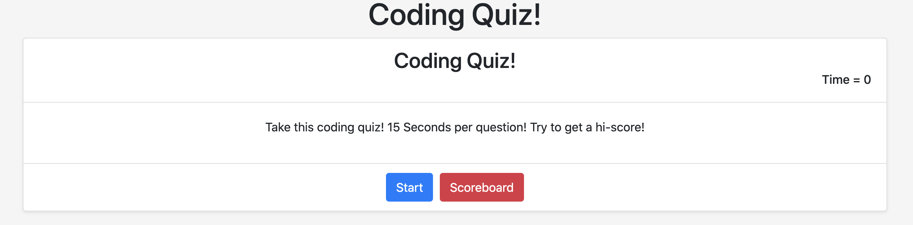
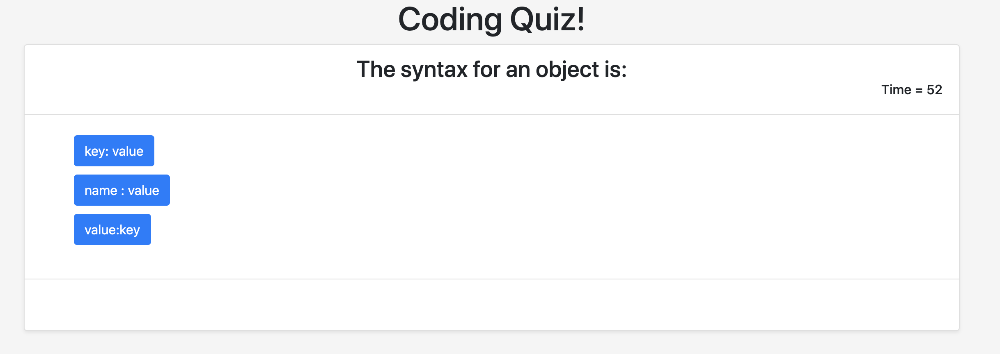
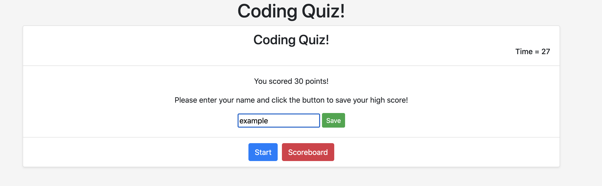
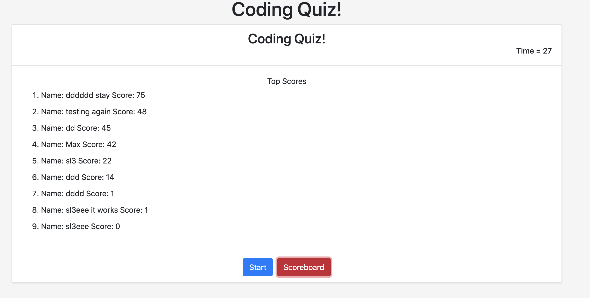

# Coding Quiz

## Description

I was instructed to create "a timer-based quiz application that stores high scores client side."
In addition, I was given a few specific pieces of guidance to adhere to:
    The time remaining must be visible at all times, beginning at 0 before the quiz begins.
    The high scores should be viewable through a button on the application.
    Score is determined by time remaining, with correct answers resulting in a higher score:
        incorrect answers should therefore take time off the clock.
    Finally, the user should be able to add their name and score to high score list, and the application as always should be responsive.
A description of my application is effectively accomplished in describing the criteria above.

As the quiz is mainly for personal use, the five question are meant to help me drill simple mistakes I find myself making when coding, small but crucial errors that have cost me time in the past.

A series of functions manipulate the central card through HTML DOM methods. While this resulted in more repetition than intended in the code, something I'd like to prevent through more careful planning in the future, the resulting application is easy to read and use on any screen.

Besides the quiz questions, questions.js contains a function that logs an example score to local storage when the page is accessed for the first time. This score is intended to be approachable, hopefully encouraging a curious user to take the quiz.

## 'Installation'/Usage

The site can be accessed at [https://mavn2.github.io/classrep/4hw/](https://mavn2.github.io/classrep/4hw). 
The code is stored in the 3hw folder in the classrep repository on my GitHub page, at [https://github.com/mavn2/classrep/tree/master/4hw](https://github.com/mavn2/classrep/tree/master/4hw).

The quiz as it appears when first accessed. Note the Start and Scoreboard buttons, as well as the timer on the top right.

The quiz in progress. Each answer doubles as a submit button, as implied by the color they share with the Start button.

The results page displays when time expires or all questions are answered. The Save button adds the user's score and the name they provide in the input field to the list of scores in local storage.

Clicking the scoreboard button sorts the saved scores and renders them in order for the user. 

## Tests

The best test for the application is to use it! Try to beat your scores, or at the very least beat my score. Add your name to the high score list, and come back to look at it later.

## Credits

Thanks to my teacher, TAs and classmates at the UW Full Stack Development Bootcamp.

Thanks to W3Schools and Mozilla for their references and tutorials located at
    [https://www.w3schools.com](https://www.w3schools.com)
and 
    [https://developer.mozilla.org/en-US/](https://developer.mozilla.org/en-US/),
    
particularly those concerning the HTML DOM API and the .sort() method.

Thanks to stackoverflow user M. Page, whose detailed answer to this question
    [https://stackoverflow.com/questions/27178124/saving-objects-in-array-for-highscore-list]
    (https://stackoverflow.com/questions/27178124/saving-objects-in-array-for-highscore-list)
showed me the problems I was having storing scores were due to my mangling of the object they saved to, rather than my method for saving them.

## License

MIT License

Copyright (c) [2020] [Max Nicolai IV]

Permission is hereby granted, free of charge, to any person obtaining a copy
of this software and associated documentation files (the "Software"), to deal
in the Software without restriction, including without limitation the rights
to use, copy, modify, merge, publish, distribute, sublicense, and/or sell
copies of the Software, and to permit persons to whom the Software is
furnished to do so, subject to the following conditions:

The above copyright notice and this permission notice shall be included in all
copies or substantial portions of the Software.

THE SOFTWARE IS PROVIDED "AS IS", WITHOUT WARRANTY OF ANY KIND, EXPRESS OR
IMPLIED, INCLUDING BUT NOT LIMITED TO THE WARRANTIES OF MERCHANTABILITY,
FITNESS FOR A PARTICULAR PURPOSE AND NONINFRINGEMENT. IN NO EVENT SHALL THE
AUTHORS OR COPYRIGHT HOLDERS BE LIABLE FOR ANY CLAIM, DAMAGES OR OTHER
LIABILITY, WHETHER IN AN ACTION OF CONTRACT, TORT OR OTHERWISE, ARISING FROM,
OUT OF OR IN CONNECTION WITH THE SOFTWARE OR THE USE OR OTHER DEALINGS IN THE
SOFTWARE.
