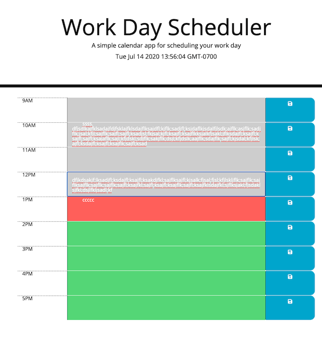
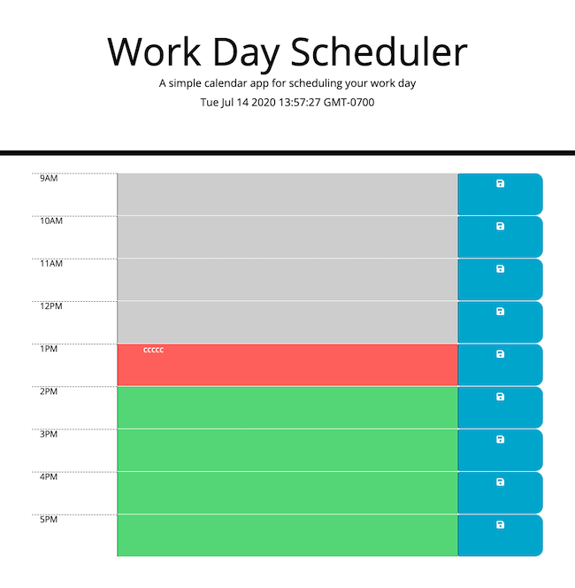

# Coding Quiz

## Description

I was asked with creating a "simple calendar application," for use by 'company employees,' and provided with some pre-existing HTML and CSS code. While more fleshed out calendar apps might offer more in depth organization or to-do list type features, this one is intended to function as a light-weight day planner. 
Each hour, defined on the left, is represented by a text area in the middle, the color of which changes with the time of day to indicate past, present, or future. The button on the right of each text-area, marked with a classic floppy-disk icon, saves the contents of the corresponding text area to local storage. If the user reopens the app, their saved items are still displayed.
The code that powers this is fairly simple. Use of the Moment and jQuery libraries allows for relatively succinct manipulation of the HTML interface, and the HTML itself uses semantic tags and common classes. Any future developer who wishes to modify the calendar to their own ends should (hopefully) find it easy to do so.

## 'Installation'/Usage

The site can be accessed at [https://mavn2.github.io/classrep/5hw/](https://mavn2.github.io/classrep/5hw). 
The code is stored in the 5hw folder in the classrep repository on my GitHub page, at [https://github.com/mavn2/classrep/tree/master/5hw](https://github.com/mavn2/classrep/tree/master/5hw).

The calendar app, pictured with placeholder text used during testing. The first text entry exceeds the boundaries of its row, and a scrollbar appears and can be used when it is moused over.

The same page after a refresh. The saved text remains, while the longer test entries that went unsaved have been cleared.

## Tests

The best test for the application is to use it! While not directly accessible, the times saved to each of the nine hour variables could be changed to fit your schedule.

## Credits

Thanks to my teacher, TAs, tutor, and classmates at the UW Full Stack Development Bootcamp.

Thanks to the jQuery Foundation for their code and excellent documentation, which can be accessed at [https://jquery.com/](https://jquery.com/).
Thanks to those who develop/maintain Moment.js and it's, again, excellent documentation, accessible at [https://momentjs.com/](https://momentjs.com/).

Finally, thanks to stackoverflow users Vins and isync, whose responses to this question
    [https://stackoverflow.com/questions/5891840/how-to-use-javascript-variables-in-jquery-selectors]
    (https://stackoverflow.com/questions/5891840/how-to-use-javascript-variables-in-jquery-selectors)
helped me a great deal.

## License

MIT License

Copyright (c) [2020] [Max Nicolai IV]

Permission is hereby granted, free of charge, to any person obtaining a copy
of this software and associated documentation files (the "Software"), to deal
in the Software without restriction, including without limitation the rights
to use, copy, modify, merge, publish, distribute, sublicense, and/or sell
copies of the Software, and to permit persons to whom the Software is
furnished to do so, subject to the following conditions:

The above copyright notice and this permission notice shall be included in all
copies or substantial portions of the Software.

THE SOFTWARE IS PROVIDED "AS IS", WITHOUT WARRANTY OF ANY KIND, EXPRESS OR
IMPLIED, INCLUDING BUT NOT LIMITED TO THE WARRANTIES OF MERCHANTABILITY,
FITNESS FOR A PARTICULAR PURPOSE AND NONINFRINGEMENT. IN NO EVENT SHALL THE
AUTHORS OR COPYRIGHT HOLDERS BE LIABLE FOR ANY CLAIM, DAMAGES OR OTHER
LIABILITY, WHETHER IN AN ACTION OF CONTRACT, TORT OR OTHERWISE, ARISING FROM,
OUT OF OR IN CONNECTION WITH THE SOFTWARE OR THE USE OR OTHER DEALINGS IN THE
SOFTWARE.
